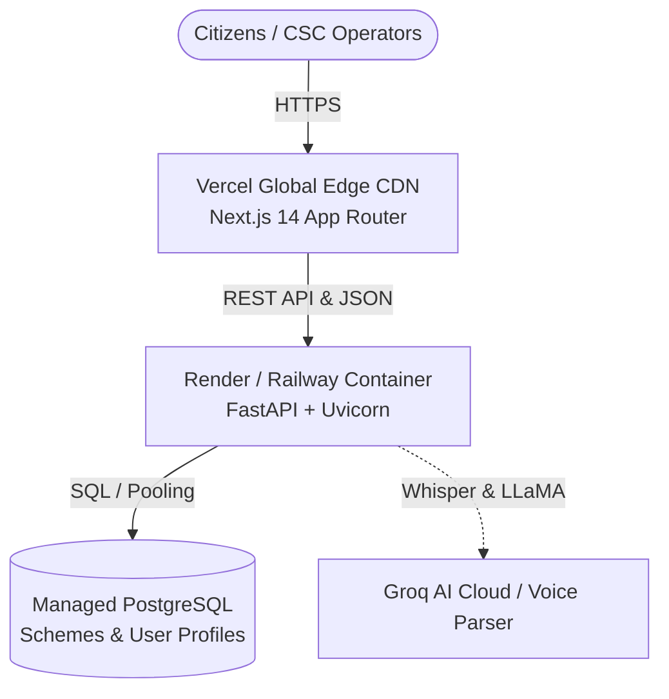

# 🚀 Sahayak Production Deployment Guide

This guide details how to deploy **Sahayak** to production using the recommended modern civic tech architecture:
- **Frontend**: Next.js 14 deployed to **Vercel** (Global Edge CDN, auto-scaling)
- **Backend**: FastAPI (Python 3.12) deployed to **Render** or **Railway** (Managed container runtime)
- **Database**: Managed **PostgreSQL** (with automated migration & scheme seeding on startup)

---

## 🏗️ Architecture



---

## Part 1: Push Code to GitHub

If you haven't yet pushed your code to GitHub:

```bash
# 1. Stage and commit your changes
git add .
git commit -m "feat: complete production civic tech platform and deployment configs"

# 2. Rename branch to main
git branch -M main

# 3. Create a repository on GitHub (https://github.com/new) and link it
git remote add origin https://github.com/<your-username>/sahayak.git
git push -u origin main
```

---

## Part 2: Deploy Backend & Database

### Option A: Render (Recommended — 1-Click Blueprint)

1. Sign in to [Render.com](https://render.com).
2. Click **Blueprints** in the top navigation bar.
3. Click **New Blueprint Instance**.
4. Connect your GitHub repository (`sahayak`).
5. Render will automatically detect [`render.yaml`](./render.yaml) and configure:
   - A free managed **PostgreSQL database** (`sahayak-db`).
   - A Python web service (`sahayak-backend`) running `./entrypoint.sh`.
6. Fill in the required environment variables:
   - `GROQ_API_KEY`: *(Optional)* Your Groq Cloud API key. (If left blank, intelligent deterministic fallback is active).
7. Click **Apply**.
8. Once deployment finishes, copy your backend URL:
   `https://sahayak-backend.onrender.com`

> **Note**: `./entrypoint.sh` automatically runs `python -m app.seed` on startup to initialize database tables and populate all official central and state government schemes!

---

### Option B: Railway

1. Sign in to [Railway.app](https://railway.app).
2. Click **New Project** $\rightarrow$ **Provision PostgreSQL**.
3. In the same project canvas, click **New** $\rightarrow$ **GitHub Repo** $\rightarrow$ select your repository.
4. In the service settings:
   - **Root Directory**: `backend`
   - **Build Command**: `pip install -r requirements.txt`
   - **Start Command**: `./entrypoint.sh`
5. Under **Variables**, add:
   - `DATABASE_URL`: `${{Postgres.DATABASE_URL}}`
   - `CORS_ORIGINS`: `http://localhost:3000,https://*.vercel.app`
   - `GROQ_API_KEY`: *(Optional)* Your Groq API key
6. Railway will generate a public domain (e.g. `https://sahayak-production.up.railway.app`).

---

## Part 3: Deploy Frontend on Vercel

1. Go to [Vercel](https://vercel.com/new) and log in with GitHub.
2. Select and import your **`sahayak`** repository.
3. In the project configuration screen:
   - **Framework Preset**: Next.js
   - **Root Directory**: Click *Edit* and select **`frontend`**
4. Under **Environment Variables**, add:
   | Key | Value | Description |
   | :--- | :--- | :--- |
   | `NEXT_PUBLIC_API_URL` | `https://your-backend.onrender.com` | Your live backend URL from Part 2 (no trailing slash) |
5. Click **Deploy**.
6. Vercel will build the project and output your live production URL (e.g. `https://sahayak.vercel.app`).

---

## Part 4: Production Verification Checklist

Once both services are deployed, test your live instance:

- [ ] **Health Check**: Open `https://your-backend.onrender.com/` — should return `{"service": "Sahayak API", "status": "healthy"}`.
- [ ] **Voice Intake**: Visit your Vercel URL $\rightarrow$ `/intake` $\rightarrow$ tap the mic button or click demo prompts to verify voice extraction.
- [ ] **Household Maximizer**: Add family members (e.g. 8-yr daughter, 65-yr mother) $\rightarrow$ verify the total unlocked welfare banner (`₹5.30 Lakh/year`).
- [ ] **Printable CSC Passbook**: Click **CSC Slip (PDF)** on `/results` $\rightarrow$ verify formatted A4 passbook slip with QR code.
- [ ] **WhatsApp Sharing**: Click **WhatsApp** $\rightarrow$ verify pre-filled scheme list and required documents checklist.
- [ ] **Seva Kendra Locator**: Enter a PIN code or city (e.g. `415001` or `Satara`) $\rightarrow$ verify CSC centers and Google Maps routing.
- [ ] **Document Pre-Check**: Click any scheme detail page $\rightarrow$ verify Aadhaar-Bank DBT seeding pre-check and readiness score.
